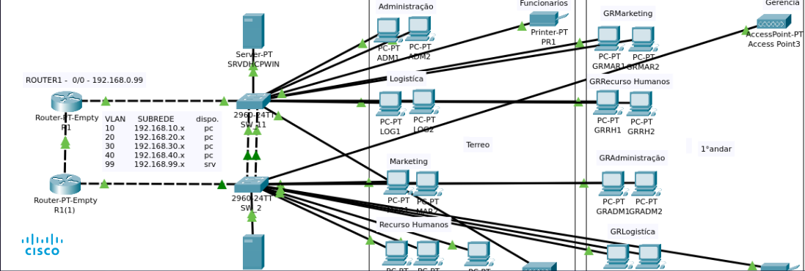

## Olá, eu sou o Vinicius 👋

Sou aluno do **Senac São Miguel**, atualmente cursando o **Técnico em Informática**. No momento, estou na UC de **Desenvolvimento**, onde coloco em prática meus conhecimentos em programação, redes e infraestrutura.

Tenho grande interesse em **redes de computadores**, **infraestrutura de TI**, **automação com Arduino**, **programação web** e **projetos integradores voltados para empresas e instituições de ensino**.

## 🔧 Tecnologias e Ferramentas que uso

- Git e GitHub (controle de versão e documentação)
- VS Code
- Apache2 
- Squid 

## 💻 Certificações

- Assistente de Suporte e Manuntençaõ de Computadores (Senac São Miguel - 272 horas)
- Assistente de Operações de Redes de Computadores (Senac São Miguel - 308 Horas)
- IT Essentials (Cisco)

## 💻 Linguagens Usadas

- Python
- Java
- HTML, CSS e JavaScript

## 📚 Projetos Relevantes

- **DATACORE - Empresa Ficticia**  
  Estruturação de uma rede com múltiplas VLANs, dois roteadores, dois switches, servidores físicos e em nuvem (HTTP e DHCP), e failover entre roteadores.

## Links

[Linkedin](https://www.linkedin.com/in/vinicius-moises/)

## ✨ Sobre mim

Sou uma pessoa curiosa, prática e apaixonada por tecnologia. Gosto de entender como as coisas funcionam e de aplicar o que aprendo para resolver problemas reais. Estou sempre em busca de evoluir, tanto em desenvolvimento quanto em infraestrutura, com foco na qualidade e na organização dos projetos.

---
